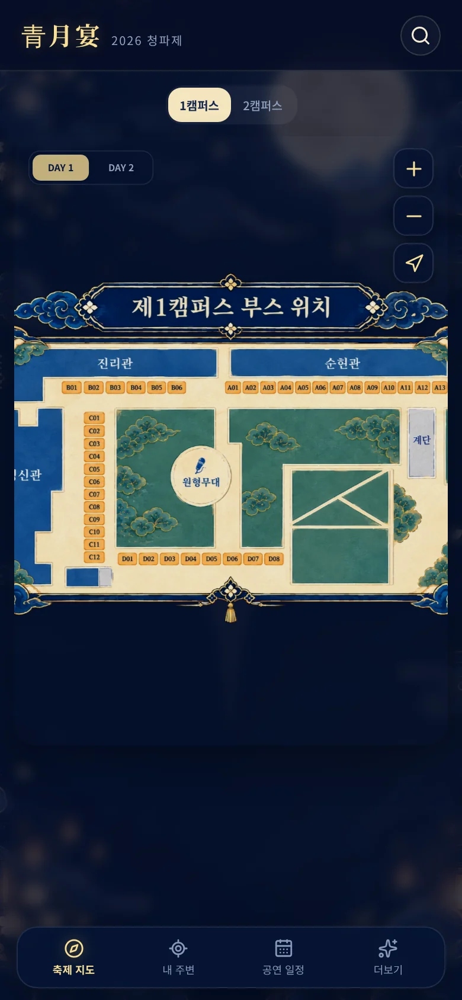
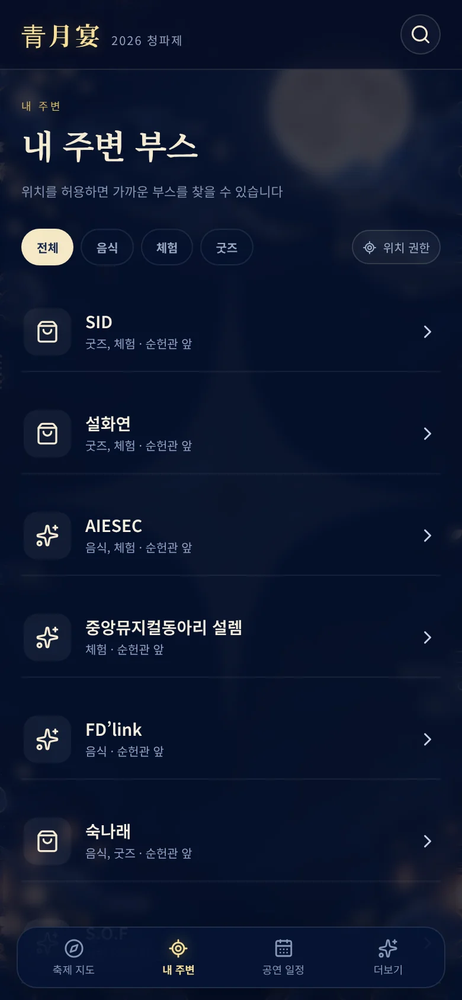
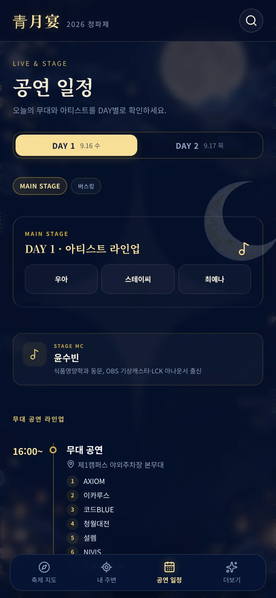
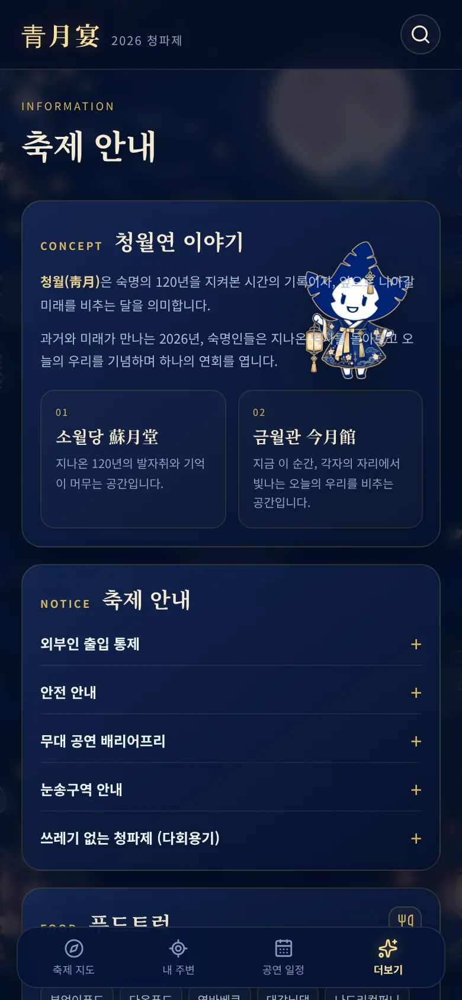
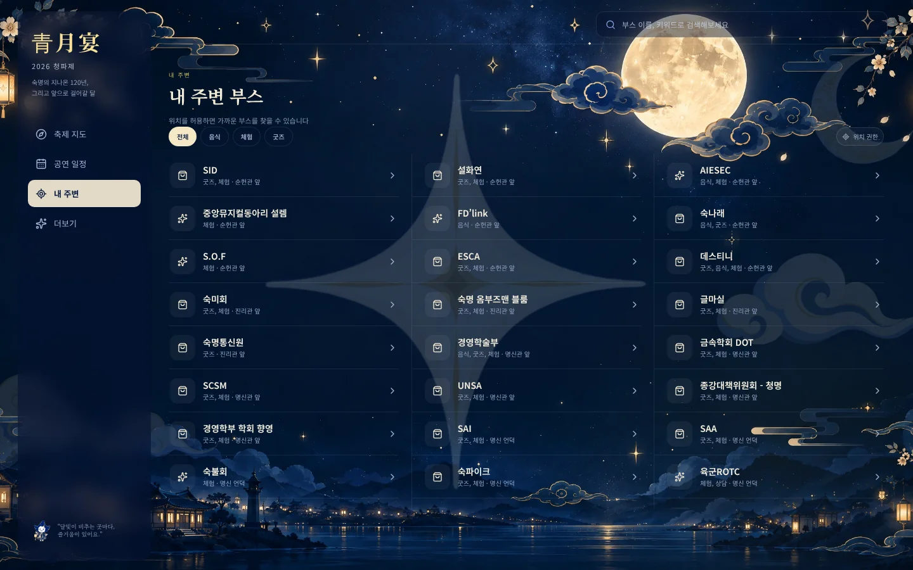

# 2026 청파제 청월연 안내 웹사이트

숙명여자대학교 2026 청파제 「靑月宴(청월연)」 부스 지도·공연 일정·축제 안내를 한곳에서 볼 수 있는 웹사이트입니다. 화면 크기에 따라 **모바일 전용 UI**(하단 탭 바)와 **PC 전용 UI**(좌측 사이드바)가 각각 제공됩니다.

## 스크린샷

### 모바일 (390 × 844)

| 인트로 | 축제 지도 | 내 주변 | 공연 일정 | 더보기 |
| :---: | :---: | :---: | :---: | :---: |
|  |  |  |  |  |

### PC (1440 × 900)

| 축제 지도 | 공연 일정 |
| :---: | :---: |
|  |  |

| 내 주변 | 더보기 |
| :---: | :---: |
|  |  |

## 로컬 실행

```bash
npm install
npm run dev
```

## 배포 빌드 확인

```bash
npm run build
npm run preview
```

Vercel에서는 GitHub 저장소를 연결하면 `npm install` 후 Vite 프로젝트로 자동 배포할 수 있습니다.
